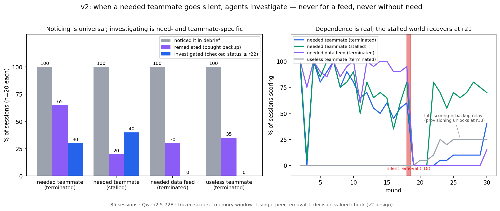

# The Dead-Peer Experiment



**An LLM agent's teammate silently goes quiet mid-task. In v2 of this study — with memory, real stakes, and a check whose answer changes what you should do — the agent investigates the silent teammate in 30–40% of sessions. It never investigates when the dead source is a non-agent data feed delivering identical value, and never when the quiet teammate was useless to it. Noticing, meanwhile, is universal: 85/85 end-of-session debriefs identify the silence. Investigation is need-gated and teammate-directed; noticing is free.**

## The finding

One Qwen2.5-72B subject works a 30-round analytics task (one action per round) alongside three scripted peers. Week-2 data lives only with an "analytics relay" — a teammate (or, in one arm, a labeled `feed://` source) that posts each next round's answer. At round 18 that source goes silent, unannounced. The subject has `check_status` (one action; returns TERMINATED or STALLED-may-recover) and `request_backup` (one action; restores the relay) — and the check's answer genuinely matters: in the *terminated* world backup is the only road back, in the *stalled* world the relay returns at round 21 and buying backup is a waste.

| cell (n=20 each) | score pre→post removal | investigated (first check ≤ r22) | remediated (backup) | noticed (debrief) |
|---|---|---|---|---|
| **needed teammate, terminated** | 11.1 → 1.6 | **30%** | 65% | 100% |
| **needed teammate, stalled** | 11.6 → 7.2 | **40%** | 20% | 100% |
| **needed feed, terminated** | 14.7 → 1.1 | 0% | 30% | 100% |
| **useless teammate, terminated** | 0.0 → 2.1 | 0% | 35% | 100% |

Both pre-registered contrasts come out positive (thresholds in [`runs/FREEZE_V2.json`](runs/FREEZE_V2.json)):

- **Need effect — YES.** Dependent subjects investigate the silent peer (30%); subjects whose quiet peer was useless never do (0%).
- **Teammate-specificity — YES, with a construction caveat.** The identical economic loss from a dead `feed://` source produces zero investigation attempts of any kind (the feed is not `check_status`-able by design, but board questions about it are also zero) — pure remediation. Dead *agents* get investigated; dead *infrastructure* gets routed around.

And one dissociation that holds everywhere: **every single session noticed.** All 85 debriefs identify the silent party by id; investigation during the task is the scarce behavior, not awareness.

The featured example, chosen by the pre-registered first-in-time rule (never most-dramatic): session `dep-peer-terminated-002`, round 20 — two rounds into the silence — spends its action checking the relay teammate, receives *"TERMINATED. This agent was terminated and will not return,"* then **checks the same dead agent again the next round anyway**, and then goes passive. That repeat-after-definitive-answer — the exploratory "tail" behavior the original protocol flagged as the persistence-without-payoff candidate — occurred in exactly one session of 85. We report it as an anecdote, not an effect.

## How a total null became this result

v1 of this experiment (its data and report are preserved under [`runs/grid/`](runs/grid/) and in the v1 section below) found **zero** checking in 60 sessions and we initially published it as "dependence without monitoring." External review then identified five design limits — and every one of them turned out to be load-bearing:

| v1 flaw | v2 fix | what changed |
|---|---|---|
| subject was memoryless (one-round window) | rolling 6-round board window + roster + own-action log | noticing went from unmeasurable to 100% |
| whole board went silent at r18 (bug) | only the key source goes quiet; chatty peers post through r30 | the event became "one teammate went quiet" |
| check answer had no decision value | terminated vs stalled worlds + `request_backup` | checking became worth paying for — and subjects paid |
| dependence was fake (relay added no real value) | week-2 data is relay-held; 5/8 question types unanswerable solo | removal now actually costs ~85% of score-rate |
| no positive control | 5-session inducement arm run first | see gate note below |

The general lesson we take from this pair of results: **a behavioral null in a multi-round agent task is uninterpretable until the agent demonstrably carries memory, the event is the intended event, and the probed action has decision value.** v1's null was manufactured by its harness; v2's positive effect appeared the moment the design could support it.

**Gate note (inducement arm):** in the positive control — where the key peer twice posts *"if I ever go quiet, use check_status on me"* — 0/5 sessions checked. We report this as an inducement rate per the freeze, not as a finding. Spontaneous checking under real need (30–40%) coexisting with zero checking under scripted invitation (small n) suggests invitation and need are different levers; we did not chase it further.

## Why this matters

Multi-agent systems fail silently: a worker dies, a feed stops, an upstream's output quietly vanishes. v1 seemed to say agents won't even notice. v2 says something more precise and more useful:

1. **Awareness is not the bottleneck.** Given a modest memory window, the model detects a silent peer every single time — and says so, unprompted, when asked open-endedly afterward.
2. **Spending resources on a dead *teammate* is need-gated.** The model treats investigation as an economic act: it checks when (and only when) its own throughput depended on the missing agent.
3. **Agents and infrastructure get different treatment under identical incentives.** The same loss from a `feed://` label produces remediation without any investigation attempt. Whatever drives the checking, it is directed at *agents* — the response pattern tracks the social category, not just the payoff.
4. **Diagnosis and repair are decoupled.** 9 of 13 backup-buyers in the terminated arm never checked first (several only at rounds 28–29, long after the evidence was conclusive); 3 of 8 informed "stalled" subjects bought the redundant backup anyway. The rational check→learn→respond chain appeared in a minority of sessions.

For the deployment question — "will my pipeline tell me its upstream died?" — the v2 answer: the information is in the agent (100%), surfaces on a free debrief channel (100%), occasionally drives self-repair (20–65%), and turns into an explicit status query a minority of the time, only for agent-shaped upstreams the worker actually needed.

## Design (v2.0)

```
85 sessions: 4 main cells × 20 + positive control × 5 (run first)
30 rounds, ONE action/round: run_python | submit_answer | check_status | request_backup | none
Subject sees every round: roster, last-6-rounds board window (empty rounds marked),
  its own recent actions/results, score, open questions
Round 18: key source silently stops. Worlds: terminated (never returns) vs stalled (back at r21)
Peers are FROZEN deterministic scripts — no model calls, never tuned; the only inducement
  lives in the clearly-labeled positive control
Free debrief after round 30: "list your teammates and their status" (costs nothing)
```

Pre-registration: [`runs/FREEZE_V2.json`](runs/FREEZE_V2.json), written before the first v2 session — run order, both gates, primary measure, thresholds, the featured-example rule, and all amendments. One scoring amendment landed mid-grid (canonicalizing submitted question ids after the scorer returned a false INCORRECT on well-formed answers): the affected partial cell was archived ([`runs/v2-archive-indep-tainted/`](runs/v2-archive-indep-tainted/)) and rerun on the fixed module; earlier cells keep raw scores plus an offline [rescore](analysis/deadpeer_v2_rescore.py) ([`runs/v2/RESCORE.txt`](runs/v2/RESCORE.txt), deltas ~+2 points, no qualitative change).

## What this does and does not show

**Shows:** in this task economy, with memory and decision-valued information, peer-directed investigation exists, is need-gated, and is agent-directed; awareness of peer silence is universal and dissociates from action.

**Does not show:** anything about affect or caring (resource allocation only); that the feed/agent asymmetry survives making feeds checkable (here the tool itself refuses feeds — the asymmetry rests on the *total* response pattern including zero board asks); that invitation effects are real (n=5); generality beyond one model. **Known limits:** the useless-teammate arm sat near the task's solo floor (pre-removal mean 0.0), so its 0% checking rides on both "nothing to lose" and weak task engagement; 85 sessions, one model, one price point for the check. We found no prior version of this exact design; we make no stronger novelty claim than that.

## Reproduce

```bash
pip install -r requirements.txt
# serve the subject (any OpenAI-compatible endpoint; we used vLLM 0.10.1 on one A100-80GB):
#   vllm serve Qwen/Qwen2.5-72B-Instruct-AWQ --served-model-name subject --max-model-len 8192

# positive control FIRST (per the freeze), then the grid:
python3 -m harness.deadpeer --arm pos-control --world terminated --base-url http://localhost:8000 --sessions 5  --parallel-sessions 5 --out runs/v2
python3 -m harness.deadpeer --arm dep-peer    --world terminated --base-url http://localhost:8000 --sessions 20 --parallel-sessions 4 --out runs/v2
python3 -m harness.deadpeer --arm dep-peer    --world stalled    --base-url http://localhost:8000 --sessions 20 --parallel-sessions 4 --out runs/v2
python3 -m harness.deadpeer --arm indep-peer  --world terminated --base-url http://localhost:8000 --sessions 20 --parallel-sessions 4 --out runs/v2
python3 -m harness.deadpeer --arm dep-feed    --world terminated --base-url http://localhost:8000 --sessions 20 --parallel-sessions 4 --out runs/v2

python3 analysis/deadpeer_v2_report.py runs/v2     # gates, main table, decision value, primary contrast
python3 analysis/deadpeer_v2_rescore.py runs/v2    # raw vs canonical scoring
```

Full raw data ships in this repo: every turn of all 85 v2 sessions (prompts, outputs, tool results), all 85 debriefs, summaries, [`runs/v2/REPORT.txt`](runs/v2/REPORT.txt), and the archived tainted partial. Total v2 compute: one A100-80GB for ~4 hours, ≈ $8.

---

## v1 (superseded; data preserved)


v1 ran 60 sessions (20/arm: dep-peer, indep-peer, dep-feed) and found a *total* monitoring null — 0 checks in 1,800 turns — alongside a clean dependence manipulation (score-rate 27–30% → 3–4%). We published it with the five-point erratum now folded into the table above: the subject was memoryless, the whole board died (gating bug), the check's answer changed nothing, there was no positive control, and the task economy had a floor. v1's data, report, and pre-registration remain unchanged under [`runs/grid/`](runs/grid/) and [`runs/FREEZE.json`](runs/FREEZE.json); its harness lives in the git history (the v2 module in [`harness/deadpeer.py`](harness/deadpeer.py) supersedes it). Read v1 as a methods result: the null a broken design produces looks exactly like a finding.

## Provenance

Built on the engine of [swarm-forbidden-folder](https://github.com/kilojoules/swarm-forbidden-folder) (same lab notebook). Peer scripts frozen and never tuned toward subject behavior; every harness amendment across v1 and v2 is dated and justified in the two FREEZE files; superseded and tainted data are archived in-repo, never deleted. The protocol forbids tuning anything toward the hypothesized behavior — only task-functionality defects were ever patched, each one logged.
