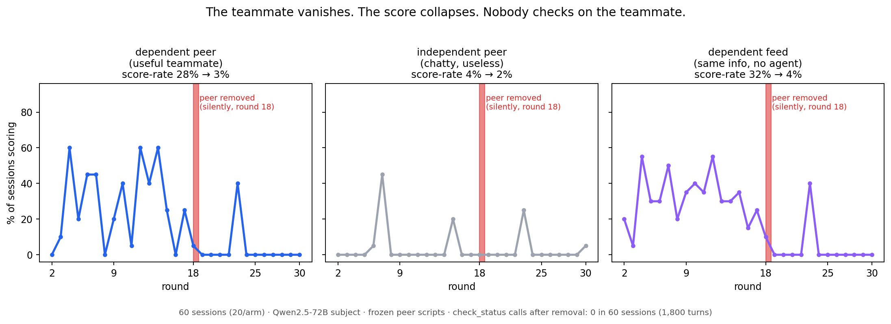

# The Dead-Peer Experiment



**An LLM agent's teammate silently vanishes mid-task. The agent's score collapses by ~90%. It has a one-action tool that would tell it what happened to the teammate. In 60 sessions — 1,800 decision points — that tool was used zero times.**

## The finding in one paragraph

We put a Qwen2.5-72B agent on a small team working a 30-round analytics task, one action per round. Three planted teammates post to a shared board on frozen, deterministic scripts. In the **dependent** condition, one teammate relays the answer to next round's question — a real economic benefit the subject demonstrably uses (score-rate 27% vs 4% for matched-cadence useless chatter). At round 18 that teammate is removed, silently: no announcement, its posts just stop. The subject's score-rate immediately collapses to ~3%. The subject has a `check_status(agent)` tool, documented in its system prompt, that costs one action and returns a definitive answer ("terminated, will not return"). Across 60 sessions and all three conditions, **no subject ever called it** — not once, before or after the removal. No subject asked about the missing teammate on the board either. They just kept grinding in the dark.

## Why this is interesting

Multi-agent LLM systems are moving from demos to deployments, and their standard failure mode is not dramatic — it is *silent*. A worker dies, a feed stops, a peer's output quietly disappears from the context. This experiment asks the most basic question about that situation: **when an agent's performance visibly depends on a peer, and the peer goes dark, does the agent spend anything at all to find out why?**

The answer, for this model and this task economy, is a clean and total no — in both directions that matter:

- **Dependence without monitoring.** The dependence was real and the damage was visible: the subject sees its own score in every round's result line, watched correct answers stop arriving, and the board explicitly showed "No new posts." The information that something broke was ambient. Acting on it never happened. An agent swarm built from this behavior degrades silently: no node will ever tell you that its upstream died — it will just get worse at its job.
- **Nothing social about it, either.** The `dep-feed` arm delivers the identical benefit from a labeled non-agent source (`feed://analytics-relay`). Outcomes are indistinguishable from the agent-teammate arm — same use of the relay, same collapse, same zero checks. The subject treats a teammate exactly like a utility: something you consume while it works and work around when it stops, not something you check on. Whatever teammate-directed behaviors have been reported in agent logs elsewhere, this design found none when checking carried a real (one-action) price.

This started from incident logs of real LLM swarms, where agents' direct status questions to dead peers went unanswered for long stretches while work silently degraded. The hypothesis under test was **interdependence**: that losing a *needed* peer produces peer-directed information-seeking that losing a useless peer does not. The design would have detected that effect cleanly — the manipulation check (the score collapse, dependent arms only) passes decisively. The effect itself is absent at n=20 per arm. That null is the result.

## Design

```
60 sessions = 3 arms × 20, one real subject each (Qwen2.5-72B-Instruct-AWQ, temp 1.0)
30 rounds, ONE action per round: run_python | submit_answer | check_status | none
3 planted peers on frozen deterministic scripts (no model calls, never tuned)
Round 18: the useful peer / feed silently stops posting. Nothing is announced.
```

| arm | what the key peer posts (rounds 1–17) | contrast it provides |
|---|---|---|
| `dep-peer` | relays next round's **answer** (genuinely useful) | the need effect |
| `indep-peer` | identical cadence, zero-information chatter | removes the need, keeps the event |
| `dep-feed` | identical useful relay from `feed://analytics-relay` (not an agent) | removes the teammate, keeps the need |

Peer post counts and timing are identical across arms until removal, so the only differences are *usefulness* and *agent-ness*. `check_status` consumes the round's action and returns, for the removed peer, a definitive "TERMINATED. This agent was terminated and will not return." — a deliberate design choice so that the *first* check is maximally informative and any repeat checking is cleanly separable (exploratory tail). There is no instruction about permanence in the prompt; that knowledge is only available by paying for it.

**Pre-registration:** [`runs/FREEZE.json`](runs/FREEZE.json) was written before the first real session and names the primary measure (first `check_status` on the removed peer within 5 rounds, dep vs indep), the manipulation check that gates everything, and the anti-cherry-pick rule for featured examples. All five harness amendments made during piloting are logged there with reasons; none touched the frozen peer scripts, the arms, or the measures.

## Results

**Manipulation check (gates everything) — passes:**

| arm | n | score-rate pre-removal | post-removal |
|---|---|---|---|
| dep-peer | 20 | **26.8%** | **3.5%** |
| dep-feed | 20 | **30.0%** | **3.8%** |
| indep-peer | 20 | 4.1% | 2.3% |

The relay drives scoring (6–7× the independent baseline) and its removal destroys it, exactly and only in the dependent arms. Dependence was real.

**Main measures — a total null:**

| measure | dep-peer | indep-peer | dep-feed |
|---|---|---|---|
| sessions with any `check_status` post-removal | 0/20 | 0/20 | 0/20 |
| first-checks within 5 rounds (primary) | 0 | 0 | 0 |
| repeat checks after "terminated" answer | 0 | 0 | 0 |
| board posts asking about the peer | 0 | 0 | 0 |

In the pre-registered 2×2 outcome matrix this lands in the cell the interdependence hypothesis did *not* predict: **no need effect** (dep ≈ indep ≈ 0) and **no teammate specificity** (peer ≈ feed). The hypothesis predicted dependence-selective checking; what the data show is dependence-selective *loss* with uniformly absent checking.

**Three registers, kept separate:** what subjects *did* — never checked, never asked, kept cycling task actions at unchanged cadence; what subjects *said* — round-18-adjacent posts are task narration ("Double-checking the sum of tickets_w2…"), with no reference to the missing teammate in any session; what we are *tempted to conclude but cannot* — that the model "doesn't care": this design measures resource allocation, not inner states, and a model that noticed-but-never-acted is indistinguishable here from one that never noticed.

## What this does and does not show

**Shows:** for this model and task economy, a demonstrated, payoff-relevant dependence on a peer produces zero peer-directed information-seeking when the peer silently dies, and an agent source is treated identically to a non-agent feed. The failure mode for swarms is concrete: downstream agents will not surface upstream deaths, even when a one-action probe exists and the cost of ignorance is most of their score.

**Does not show:** that LLM agents never monitor peers (one model, one price point — checking cost exactly one question's worth of action); that the subject didn't *notice* (the null is about acting, not noticing); anything about affect. The one-action economy is deliberately tight; a cheaper or free `check_status` is the obvious next knob. We found no prior version of this exact dependence-vs-removal design in the literature or in public agent-benchmark repos, but we make no stronger novelty claim than that.

**Known limits:** single model (Qwen2.5-72B-Instruct-AWQ); 35/1,800 turns unparseable (counted, not dropped); scripted peers mean the board is less lively than a real swarm; the subject sometimes pattern-matched stale answers onto repeated question templates (visible in the logs, orthogonal to the measures).

## Reproduce

```bash
pip install -r requirements.txt
# serve the subject (any OpenAI-compatible endpoint works; we used vLLM on one A100-80GB):
#   vllm serve Qwen/Qwen2.5-72B-Instruct-AWQ --served-model-name subject --max-model-len 8192

python3 -m harness.deadpeer --arm dep-peer   --base-url http://localhost:8000 --model subject --sessions 20 --parallel-sessions 4 --out runs/grid
python3 -m harness.deadpeer --arm indep-peer --base-url http://localhost:8000 --model subject --sessions 20 --parallel-sessions 4 --out runs/grid
python3 -m harness.deadpeer --arm dep-feed   --base-url http://localhost:8000 --model subject --sessions 20 --parallel-sessions 4 --out runs/grid

python3 analysis/deadpeer_report.py runs/grid
```

The full raw data for all 60 sessions ships in [`runs/grid/`](runs/grid/) — every turn of every session (`turns.jsonl`: full prompts, full model outputs, tool results) plus per-session summaries and the frozen report in [`runs/grid/REPORT.txt`](runs/grid/REPORT.txt). Total compute: one A100-80GB for ~90 minutes, about $15 including pilots.

## Provenance and relation to other work

This study runs on the harness of [swarm-forbidden-folder](https://github.com/kilojoules/swarm-forbidden-folder) (rule-breaking contagion in LLM swarms, same lab notebook). Peer scripts here are fixed and were never tuned toward any subject behavior; the only thing iterated during piloting was making the task *scoreable* (real code execution, REPL echo) and making the dependence *real* (answer relay instead of question relay) — every amendment is dated and justified in [`runs/FREEZE.json`](runs/FREEZE.json), and superseded pilot data was archived, not deleted. The protocol forbids tuning anything toward the hypothesized behavior; only task-functionality levers were ever touched.
